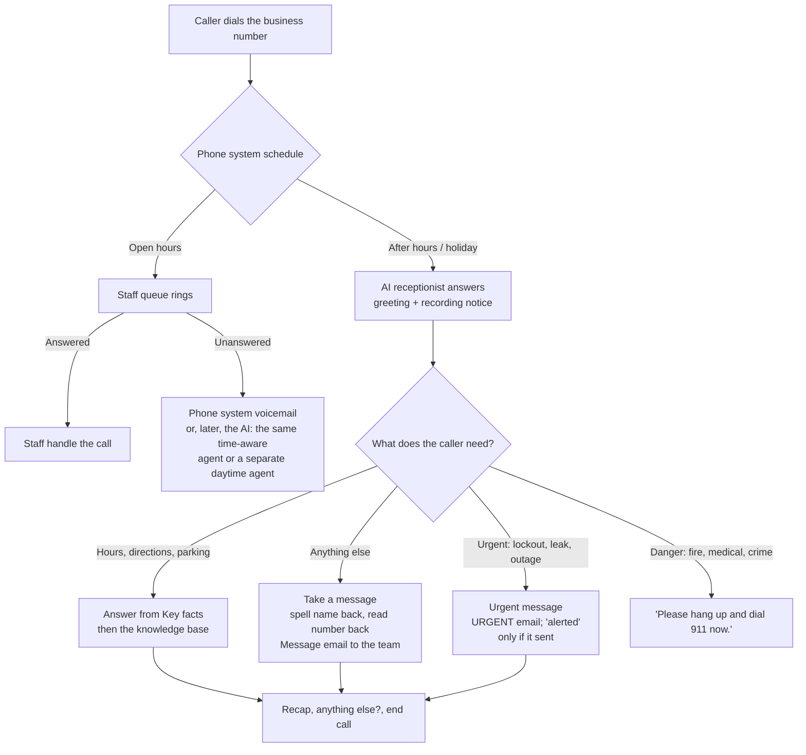
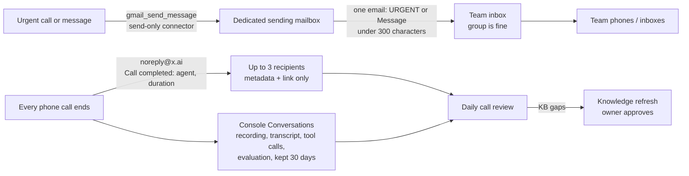

# Answering Machina

**The modern-day answering machine, only better: an open-source AI receptionist that picks up when your front desk can't.**

*From Peter Chee, founder of **Thinkspace**, a coworking and virtual office business in Redmond and Seattle, WA.*

[](https://x.ai/bot/FUSB3whX23EEO5aiyTk0P)

> **v0.1, early release:** running at one real business so far, on the main lines at its two locations; test on the free xAI number and complete the [go-live checklist](docs/go-live-checklist.md) before you route yours (see [Known limits](#known-limits)).

## Choose your setup
Pick the AI assistant you already use (the **operator**) and the voice AI that answers the phone (the **platform**). The receptionist's design, rules and tests are the same either way ([the core](core/README.md)).

**Recommended: Grok Bot with xAI's Grok Voice Agents.** It's the simpler path. xAI's voice agent has a built-in Gmail connector, so it can send the in-call URGENT and Message emails with no other service, and the Grok Bot template sets everything up for you. It's also the path we've tested on a real line.

**If you already use ChatGPT or Claude,** the Retell AI route works with those assistants. Expect more manual setup, and plan on a third-party automation account (Zapier or n8n) for in-call email alerts, because Retell agents have no built-in email tool.

| You use | Voice platform | Status | Start here |
|---|---|---|---|
| **Grok Bot** (recommended) | xAI Grok Voice Agent Builder | Live at one business, on two main lines. Built-in Gmail alerts | The **Add** button above, then the [Quick start](#quick-start) |
| **ChatGPT** (a dot, a project or a regular chat) | Retell AI | New. Written from OpenAI's and Retell's docs, not yet tested by us. Email alerts need Zapier or n8n | [operators/chatgpt-dot/INSTRUCTIONS.md](operators/chatgpt-dot/INSTRUCTIONS.md) |
| **Claude** (claude.ai, Claude Desktop, Claude Code) or another MCP assistant | Retell AI | New, not yet tested by us. Email alerts need Zapier or n8n | [operators/claude](operators/claude/README.md) |
| No assistant | Either | | [platforms/](platforms/README.md) |

All operators: [operators/](operators/README.md). Platform comparison: [platforms/](platforms/README.md).

## Why we built this

Our front desk is small, and the phone is only one part of the job. The same people greet members, give tours, sort mail and packages, and keep the space running. So the phone sometimes rings while they're walking a visitor through the building or at the mailroom. The desk also has hours, and people keep calling just after we close and just before we open.

We knew some calls were going unanswered. We didn't know how many, so we pulled nine months of records from our phone system. Here's what our two main lines showed for **Jan 1 – Sep 29, 2026**:

- **328 of 2,138 real inbound calls went unanswered.** That's about 15%, roughly 1 call in 6 or 7, or 1.2 a day.
- **About two-thirds of those happened during business hours**, and in most of them no desk phone was on another call. The records can't show why, but it fits a desk where whoever is on duty is often helping someone in person, giving a tour or handling a delivery.
- **After-hours misses cluster right around closing and opening:** 4–6 PM and 6–8 AM. Late nights and weekends were rare.
- **63% of callers who reached voicemail hung up without leaving a message.** For most people, voicemail is a dead end.
- **About 30% of missed calls were followed by the same caller trying again within a day.** These are real people who need something.

Getting to those numbers took some cleanup. Almost half of the raw phone records turned out to be our own door call boxes buzzing the desk, not customers. After we removed those, plus internal calls, outbound calls and obvious spam, the picture was clear. This isn't about effort. It's coverage: one person can't be at the desk, on a tour and at the mailroom all at once.

## What we built

We built **Tess**, an AI receptionist, on xAI's [Grok Voice Agent Builder](https://x.ai/news/grok-voice-agent-builder), and we did it in one day with Grok Bot. Grok Bot interviewed me about the business, drafted Tess's script and knowledge base, and built the agent in the xAI console while I watched. Then it tested her on a free phone number, well away from our real lines.

Tess now answers the main lines at both our locations, Seattle and Redmond, in two ways. Our phone system decides when she gets a call and forwards it to her free xAI number. After hours and on the holidays listed in our phone system, she's the first to pick up. During open hours (Monday to Friday, 8 AM to 4 PM), calls ring the front desk for about 20 seconds (roughly 4 rings), and if nobody picks up, the call goes to Tess instead of voicemail. It's one agent, not a separate daytime agent, with a time-aware prompt and a greeting that works at any hour: she checks the time, and during the day she says the team is busy helping others instead of saying we're closed. She:
- answers questions about our hours, directions and parking, and takes a message for everything else, pricing included,
- takes a message, spelling the caller's name back and reading their number back, and emails it to our team inbox right away,
- sends an urgent alert email when a call can't wait, like a member locked out of the building, and says the team has been alerted only after that email actually sends,
- tells anyone in danger to hang up and dial 911.

She doesn't transfer calls yet.

Next, we'll round out what she knows, let her route calls to the right person, and look at our door call boxes (see [Next: door call boxes](#next-door-call-boxes)).

**Where it stands (as of 2026-09-30, end of day PT):** Tess is live at both locations. She answers after hours and takes daytime calls the desk doesn't pick up within about 20 seconds. Sep 30 was the first full day live at both, and the results are under [Day one](#day-one-sep-30-2026). Getting here: she passed end-to-end phone tests on her free xAI number on 2026-09-29, and the urgent alert and the post-call email both arrived. That same night she went live on our Redmond main line after hours, and a real test call to the main line after hours reached her. We also turned on daytime backup that first night. That was my call as the owner, and it's sooner than this kit recommends (run after hours only for a week or two first). To make it work with one agent, we changed her prompt to check the time and adjust its wording. On Sep 30 the daytime path took its first real calls. We made each routing change only with an owner's OK and a written rollback plan.

On our line, every real call now produces exactly one email to the team: an urgent alert, a message, or a short recap. Spam, wrong numbers and instant hang-ups get none. The short recap for answer-only calls isn't in the kit's templates yet; they still follow the [email policy](#guidelines) below.

For the first two weeks, Grok Bot runs a review every weekday at 7 AM. It reads the emails, scores every transcript, and checks that the agent is Live, its number is attached and there's credit left (it warns us under $5, or on a weekday with no calls). It drafts fixes, and nothing changes without my OK. We have one day of real-caller results so far (see [Day one](#day-one-sep-30-2026)), and we won't claim more than we've counted.

**Proving it worked cost almost nothing.** We started with $10 of xAI credit, built Tess, got a free test number, and made our first five real phone test calls. The console showed $0.37 of usage for all of them. We didn't connect our real business line, buy any equipment or hire anyone to set it up until those tests passed.

## What we'll measure

"The AI answered" is activity, not an outcome. The outcome is whether the caller got what they needed, or whether the team completed the follow-up. After the first few weeks of real calls, we plan to publish a small, anonymized results report:
- calls the receptionist handled,
- how many ended with a useful answer or an actionable message,
- urgent alerts: how many sent successfully,
- how many messages led to a completed follow-up,
- the real cost, and the time we spent reviewing calls.

No caller names, numbers or call content, and only figures we've actually counted.

### Day one: Sep 30, 2026

Sep 30 was our first full day with Tess live at both locations. These figures come from our phone system's call log joined with the AI's call list in the xAI console. They count real outside calls on our two main lines, and leave out door buzzers, my own test calls and an automated listing-check bot.

| Location | Real calls | Callers | Answered by staff | Went to the AI | Went to voicemail |
|---|---|---|---|---|---|
| Seattle | 8 | 5 | 6 | 2 | 0 |
| Redmond | 6 | 5 | 5 | 1 | 0 |

The desk picked up most calls itself, the AI took the ones it couldn't get to in time, and nothing went to voicemail on either main line. The AI's 3 real calls:
- a vendor confirming an appointment: Tess took the message and emailed it to the team,
- the same vendor calling again,
- a first-time caller who hung up during the greeting, 13 seconds in.

There were no urgent calls and no after-hours calls. One day is a small sample, so read this as a first look, not a result.

**What day one taught us:**
- **Forwarded calls show your own number.** When our phone system forwards a call, the AI sees the business's own number as the caller ID, not the caller's. It only gets the real number by asking, which is one more reason it reads the number back on every message.
- **Keep the AI's own email as the record of truth.** For a window of roughly six hours, some conversations weren't saved in the xAI console, but the AI's own emails kept working.
- **Bots call too.** An automated listing-check bot called twice and just said "Hello?" over and over. The AI correctly sent no recap.
- **Join the two logs.** The AI's call list only shows the calls it got. Joining it with the phone system's call log is what gives the real picture. We first misread a quiet stretch as missing data; the log showed staff had simply answered everything.

## Next: door call boxes

Our two door call boxes ring the front desk too. From our phone system's records for **Jan 1 – Sep 30, 2026**:

- **The boxes rang 3,962 times**, about 20 buzzes per weekday across both sites.
- **Staff answered about 3,500.** Talk time was only about 14.6 hours for the year so far (12 to 17 seconds on average), but each pickup is an interruption to whatever else they're doing.
- **457 buzzes went unanswered**, about 51 a month. After an unanswered buzz, the box rang again within 2 minutes 23–30% of the time: someone was still waiting at the door.
- **563 buzzes came after hours.**

It's the same coverage problem as the phones: the people who answer the door are also greeting members, giving tours and handling deliveries.

The first door buzz that reached Tess got the normal phone greeting, and the visitor gave up without saying anything. Door calls need their own greeting. Staff let visitors in by pressing a digit on the phone keypad, so the next test is whether the AI can send that tone, along with a rule for who it may let in. **AI door unlocking is untested.** Until it's tested, the kit's rule stands: the receptionist can't unlock doors, give codes or change access.

## Guidelines

- **Test cheaply before you trust it.** Build the receptionist, call it yourself on the free test number, try to break it, test the urgent alert, and only then let it touch your real phone line.
- One email policy, one recipient (`<team inbox>`), at most one successful email per call: an urgent call gets one `URGENT: <Location>` email; a non-urgent call that produces a message gets one `Message: <Location>` email; spam, wrong numbers and answer-only calls get none. A second try happens only if the first send fails. The one-recipient rule lives in the prompt (see [Known limits](#known-limits)). The provider's post-call summary email remains separate.
- On an urgent call, the receptionist says "I've marked this urgent" and says the team has been alerted only after the email actually sends. If it fails twice, it never says the message is saved or that the team will see it. It says: "I wasn't able to send your message to the team just now, so I can't confirm they've received it. I'm sorry about that." Then it points anyone in danger to 911 and offers an approved alternative if you set one, or asks the caller to call back during front desk hours or the next business day. Message emails get the same honesty. The daily call review catches urgent calls with no matching URGENT email.
- Follow-up wording depends on the time: "as soon as someone is free" during open hours, "the next business day" after hours. During open hours it never tells callers you're closed.
- Difficult callers are handled calmly: profanity may get one warning, sexual or harassing language ends the call without a message, threats trigger 911 guidance plus an urgent alert, and self-harm gets 988/911 guidance, an urgent alert and no premature hang-up. Never argue, judge or repeat the caller's words. 988 is US-only.
- No deals or freebies: do not agree, refuse or hint at free or discounted space, rooms, trials, waived fees, special rates or other deals, even if the caller insists or claims a promise. Say "I'm not able to arrange that, but I can take a message for the team," take a message including the request, and never book, hold, reserve or grant access.

See [`templates/prompt.md`](templates/prompt.md), [`templates/guardrails.md`](templates/guardrails.md) and [`templates/alerts.md`](templates/alerts.md) for the full rules.

## What it does for you

Answering Machina packages everything we learned into a kit you can reuse for your own business:

- **Callers get an answer instead of voicemail.** They hear your hours, directions and parking, or leave a properly taken message.
- **Messages and urgent calls reach you right away**, as one short email to the team inbox you pick.
- **Your phone system stays in charge.** The AI only gets the calls you route to it, and your routing changes only when you say so.
- **Every call can be reviewed.** Every call should leave a recording and transcript in the xAI console (kept 30 days; see [Known limits](#known-limits) for a gap we hit), and each phone call that lasts at least the minimum you set triggers a metadata-only "Call completed" email. Grok Bot can review them every weekday morning.
- **It's cheap to run.** At xAI's published rates, a call on the free number costs about 9 cents a minute (see [What it costs](#what-it-costs)).

## What it costs

**Our early number:** our first five real phone test calls, on the free xAI number, cost **$0.37 total** out of $10 of starter credit. That's what we saw, not a rate. It's lower than xAI's published $0.09 a minute would predict, and we haven't worked out why, so budget from the published rate. After a full day of building and testing, including browser test sessions, we had about $9 of the $10 left. The smallest credit top-up xAI allows is $5 (as of Sep 29, 2026), so that's the real minimum to start.

**Our first full day live (Sep 30, 2026):** the AI took 12 calls across both locations, test calls included. Estimated from call durations at the published $0.09 a minute, that's about **$1.04 for the day**, and about **$0.10** for the real calls. These are estimates from durations, not billed amounts.

**xAI's published rate:** $0.08 per minute of audio, plus $0.01 per minute on the free phone number ([xAI pricing](https://docs.x.ai/developers/pricing), [Voice Agent Builder announcement](https://x.ai/news/grok-voice-agent-builder)). That's $0.18 for a 2-minute call and $0.27 for a 3-minute call. For more detail and what we haven't verified, see [Cost details](#cost-details).

**Other AI answering services**, from each company's own pricing page, as checked on Sep 29, 2026:

| Service | Billed by | Entry plan | Beyond what's included |
| --- | --- | --- | --- |
| [Phone2](https://www.phone2.ai/pricing) | Call | $99/mo, 500 calls | $0.99/call |
| [Upfirst](https://www.upfirst.ai/pricing) | Call | $24.95/mo, 30 calls | $1.50–$0.70/call, by plan |
| [Aira](https://www.getaira.io/agents/receptionist/pricing) | Call | $24.95/mo, 30 calls | $1.50–$0.70/call, by plan |
| [Smith.ai AI Receptionist](https://smith.ai/pricing/ai-receptionist) | Call | Free, 25 calls; Pro from $150/mo, 75 calls | $2.10–$3.00/call, by plan |
| [Trillet AI Receptionist](https://www.trillet.ai/pricing) | Minute | $49/mo, 150 min | $0.20/min |
| [Rosie](https://heyrosie.com/pricing) | Minute | $49/mo, 250 min | Moves you up to the next plan |
| [Dialzara](https://dialzara.com/pricing) | Minute | $29/mo, 60 min | $0.48–$0.35/min, by plan |
| [Goodcall](https://www.goodcall.com/pricing) | Unique caller | $79/mo, 100 callers, unlimited minutes | $0.50/caller |

Prices change, so check the links before you decide. These services set things up for you and bundle features this kit doesn't have. With this kit, the tradeoff for the lower per-call cost is the owner's time for setup and review. The full fact-check, with the math, is in [docs/research/pricing-factcheck.md](docs/research/pricing-factcheck.md).

## Works with
- **Voice AI**: xAI's Grok Voice Agent Builder (tested). **Retell AI** is documented from Retell's public docs but not yet tested by us (see [platforms/retell](platforms/retell/README.md)).
- **AI assistant**: built for Grok Bot on xAI. For Retell, ChatGPT (with or without a dot) through Retell's ChatGPT app, or Claude and other MCP clients through Retell's MCP server (see [operators/](operators/README.md)); neither tested end to end yet. Manual use is supported (see [Manual use](#manual-use-without-grok-bot) for xAI, or the [Retell guide](platforms/retell/README.md)).
- **Phone systems**: anything that can forward calls to an outside number. Tested on a NetSapiens-based hosted PBX. Setup steps are documented, but not yet tested by us, for Google Voice for Google Workspace, RingCentral, and AT&T, Verizon and T-Mobile conditional forwarding (see [docs/phone-systems.md](docs/phone-systems.md)). The free personal Google Voice can't forward to the agent, because forwarding needs a verification code step the agent can't complete.

## Known limits
- **Early release (v0.1).** One real deployment so far (one business, two locations). Expect rough edges.
- **Retell support is untested.** xAI is the only platform running on a real line. The Retell guide and the ChatGPT and Claude operator instructions come from public docs and list open "TODO: verify" items. Retell also has no built-in email tool, so in-call alerts need a third-party automation account, Zapier or n8n (see [platforms/retell](platforms/retell/README.md#7-email-alerts-during-a-call)).
- **No live transfers yet.** The receptionist takes messages instead of connecting callers to staff. The **business-hours-mode** playbook describes optional daytime transfers, but we haven't tested them.
- **English only.** We've only tested English. The template tells the agent to reply in the caller's language if it can, so check that line in the Instructions first, and test any other language before you rely on it.
- **Answers only from its knowledge base** (the Key facts block plus the uploaded files). Everything else becomes a message.
- **A call can fail silently if your xAI credit runs out.** Turn on auto top-up in the xAI console's billing settings, or set up a low-credit check, and do the daily health check in the [go-live checklist](docs/go-live-checklist.md).
- **Post-call emails from xAI carry no transcript** (and no summary). Transcripts stay in the console for 30 days.
- **Recipient restriction is prompt-level only.** The Instructions tell the agent to email only your team inbox. Send-only access limits which actions the agent has, but not who it sends to. Unless you configure and verify an independent recipient allowlist, a persuasive caller or a model mistake could get an email sent to another address. A fixed-destination alert tool (a webhook, or a sending account that can only reach one address) is the better design; see the Risk section in [templates/alerts.md](templates/alerts.md#risk).
- **Forwarded calls hide the caller's number.** When your phone system forwards a call, the AI may see your business's own number as the caller ID. It only gets the caller's real number by asking, so keep the read-back step.
- **The console can miss conversations.** On our first full day, some conversations weren't saved in the xAI console for roughly six hours, while the AI's own emails kept working. Treat the AI's email to the team as the record of truth.
- **Bots call too.** Automated callers, like a listing-check bot that just says "Hello?", will reach the AI. Expect them in your counts, and check that they get no email.
- **Door call boxes aren't supported yet.** A door buzz that reaches the AI gets the regular phone greeting, and the AI can't unlock doors. See [Next: door call boxes](#next-door-call-boxes).
- **Only one day of real-caller results so far.** See [Day one](#day-one-sep-30-2026) and [What we'll measure](#what-well-measure).

More technical detail is under [Limitations](#limitations).

## Quick start
These steps are for Grok Bot and xAI. Using ChatGPT or Claude with Retell? Start with [operators/chatgpt-dot/INSTRUCTIONS.md](operators/chatgpt-dot/INSTRUCTIONS.md) or [operators/claude](operators/claude/README.md) instead.

1. **Add Answering Machina to Grok Bot and answer its questions.** [Add the template](https://x.ai/bot/FUSB3whX23EEO5aiyTk0P) and it starts the interview on its own. (You can also give Grok Bot the seven playbooks in [`skills/`](skills/) and ask it to run **getting-started**.) It asks one question at a time: your hours and locations, your phone system, what counts as urgent, where alerts go, and the exact recording notice you want.
2. **Review its drafts, then let it build and test.** It writes the script, guardrails and knowledge base for you to check. Then it builds the agent in [console.x.ai](https://console.x.ai) while you're signed in, and you run the test script from your cell on the free xAI test number. **This step is required:** don't route a real line until the tests pass and the [go-live checklist](docs/go-live-checklist.md) is complete.
3. **Turn it on when you're ready.** It checks your phone system without changing anything, writes a routing plan with a rollback, and makes the change only when you say so. We recommend starting with after hours and adding daytime overflow once you trust it.

No Grok Bot? Everything works by hand too. See [Manual use](#manual-use-without-grok-bot).

---

## Who it's for
- Small businesses with a front desk that is sometimes busy or closed: coworking spaces, offices, clinics, studios, property managers, trades.
- Owners who want calls answered **without** handing an AI their whole phone system.
- People setting this up for a client who want a repeatable, reviewable process.

## How it works
Your phone system stays in charge and sends calls to the AI **only** when you tell it to: after hours at first, and later as daytime overflow, either to the same time-aware agent or to a separate daytime agent. The agent answers from a short **Key facts** block plus a small knowledge base, takes messages, and never transfers after hours. For each message or urgent call, it sends one short email to your team inbox through a send-only Gmail connector. xAI sends a metadata-only "Call completed" email for each phone call that lasts at least the minimum duration you set, and the full transcript lives in the console. (On Retell, the email goes through a function you set up, and transcripts live in Call History; see [platforms/retell](platforms/retell/README.md).)

### Call flow


### Alert and review path


## What's in the box
```
core/        map of the platform-neutral core (templates, docs, skills, examples)
platforms/   xai/ (links to the original guide), retell/ (Retell AI guide + prompt changes)
operators/   grok-bot/, chatgpt-dot/INSTRUCTIONS.md (ChatGPT + Retell), claude/
skills/      7 playbooks: getting-started, receptionist-design, voice-agent-setup,
             phone-forwarding, business-hours-mode, call-review, knowledge-refresh
templates/   intake, prompt (with Key facts), guardrails (10 + extras), intents,
             test-script, alerts, welcome lines, kb/ examples
examples/    sunny-desk-coworking/: a complete fictional deployment
docs/        phone-systems, recording-consent, go-live-checklist, call-review,
             troubleshooting, CONTRIBUTING, research/
.github/     issue templates (bug report)
CHANGELOG.md release notes
```

## Setup with Grok Bot, step by step
1. **Interview** (**getting-started**). [Add the Grok Bot template](https://x.ai/bot/FUSB3whX23EEO5aiyTk0P), or give Grok Bot the playbooks in [`skills/`](skills/). The bot asks one question at a time about key facts, your phone system, urgent calls, the team inbox for alerts and messages, and the recording sentence.
2. **Drafts** (**receptionist-design**). It writes the Instructions, guardrails, KB and test script in a folder on its computer for you to review.
3. **Console build** (**voice-agent-setup**). You sign in to [console.x.ai](https://console.x.ai) in the bot's browser. The bot takes a screenshot before and after each change and asks your OK before each live step. You do every sign-in yourself; it never handles keys or passwords.
4. **Phone test (required).** Call the free xAI test number from your cell and run the whole test script before routing any real line. Check urgent alerts, message emails and post-call emails with real phone calls, and complete the [go-live checklist](docs/go-live-checklist.md).
5. **Routing** (**phone-forwarding**). The bot reviews your phone system read-only, writes a routing plan with a rollback, and makes the after-hours change only when you say so.
6. **Ongoing** (**call-review**, **knowledge-refresh**). It reviews calls every weekday morning and keeps the knowledge current. It also does a daily health check (a known test call, or at least confirming the agent is Live, its number is attached and it has credit). After 1 to 2 weeks, you can add daytime overflow (**business-hours-mode**): the same time-aware agent, or a separate daytime agent.

## Manual use (without Grok Bot)
1. Copy `templates/` to a new folder and fill in `intake.md`.
2. Fill in `prompt.md` (keep the **Key facts** block), `welcome.txt`, `guardrails.md` and `kb/`. Use `examples/sunny-desk-coworking/` as a model.
3. In console.x.ai, go to Voice Agents and create an agent from **Customer Support**. Then:
   - Paste the Instructions, reload, and check that the first and last lines survived.
   - Add the **10** guardrails (Name + Description).
   - Set the Welcome message and time zone, and decide on **Know caller's phone number**.
   - Upload the KB to a file collection and enable `end_call`.
   - Connect Gmail **with only Send Message enabled**, using a dedicated mailbox.
4. Publish. Add a free test number (Deployment, Add number) and set up post-call notifications (up to 3 addresses, with a minimum duration such as 10 s).
5. **Required:** run `templates/test-script.md` **by phone** on the free xAI test number before routing any real line. "Try it live" needs a microphone and never sends post-call emails.
6. **Required:** work through `docs/go-live-checklist.md`, then route after-hours calls using `docs/phone-systems.md`. Review calls daily with `docs/call-review.md`, and do the daily health check from the checklist.

## Cost details
Checked against xAI's published pages on 2026-09-29. Check the current [xAI pricing page](https://docs.x.ai/developers/pricing) before you budget.
- **Voice agent audio**: $0.08 per minute ([xAI pricing](https://docs.x.ai/developers/pricing)). The [Voice Agent Builder announcement](https://x.ai/news/grok-voice-agent-builder) says agents are billed at the API rate, with voices included and no separate platform fee.
- **Free provisioned phone number**: the number itself is free, and calls on it cost **an extra $0.01 per minute** (same announcement).
- **Post-call notification emails**: the settings dialog says "No charge per email".
- **Worked example** (those two rates only): a 2-minute call on the free number is 2 × ($0.08 + $0.01) = **$0.18**.

**Not known or not verified** (we won't guess):
- Whether knowledge-base searches inside the Builder are billed separately. The API pricing page lists `collections_search` at $2.50 per 1,000 calls and collection storage at $0.10/GiB/day for API use, but doesn't say whether or how that applies to Builder agents.
- The cost of a second number (for example, for a daytime agent) and of bring-your-own-number SIP trunking, which your provider sets.
- Your phone plan's charges for forwarded calls. A forwarded call can use minutes on your plan as well as xAI minutes.
- The cost of the dedicated Gmail or Workspace mailbox, and of running Grok Bot.

Building on Retell instead? Its rates and a worked example are in [platforms/retell](platforms/retell/README.md#cost).

## Limitations
These are the xAI build's limitations. Retell's are in [its guide](platforms/retell/README.md#limits).
- **Beta console.** xAI's Voice Agent Builder is in beta, and its screens and limits change. The skills say what was seen and when, and flag anything unverified.
- **No schedule in the agent.** Your phone system decides when calls reach it. A time-aware prompt only changes what the agent says.
- **Post-call email is metadata only**, with no summary or urgency flag. Details stay in Conversations for 30 days.
- **Urgent alerts depend on the agent** classifying the call correctly and on the Gmail connector staying signed in. Test them with real phone calls and review daily.
- **Send-only still means the agent can send email, and it limits actions, not recipients.** Anyone who can talk to the agent can trigger its enabled tools. The connector is send-only so the agent can't read, forward or delete mail, and the Instructions name a single recipient, but that recipient rule is prompt-level only unless you add an independent, verified allowlist or a fixed-destination alert tool.
- **Knowledge search can miss facts**, so the basics go in the Key facts block.
- **At most 10 console guardrails.** Extra rules go in the Instructions.
- **Transfers, if you add them, are cold** (unannounced). We haven't tested them, and they're off after hours by design.
- **Configuration is by hand.** We didn't see any export or config API, so keep your files and screenshots.
- **"Try it live" needs a microphone** and doesn't send post-call emails.
- Free provisioned numbers are released after 30 days without calls, according to the console.
- Concurrency limits for Builder calls aren't documented. Test every language you rely on.
- The phone and consent docs are US-focused. **Nothing here is legal advice.**

## Related projects
- [AIVA](https://github.com/7XLabs/Aiva): an open-source, self-hosted AI voice receptionist built on Claude, Twilio and Next.js. Not affiliated with this project.

## Contributing
See [docs/CONTRIBUTING.md](docs/CONTRIBUTING.md). Don't include real personal data or secrets, and verify everything or mark it as unverified.

## License
Answering Machina is released under the [MIT License](LICENSE). Copyright (c) 2026 Peter Chee.

**Not affiliated with xAI.** This is an independent project, not affiliated with, sponsored by or endorsed by xAI, OpenAI, Anthropic or Retell AI. "Grok", "xAI", "ChatGPT", "Claude", "Retell" and other product names belong to their owners.
