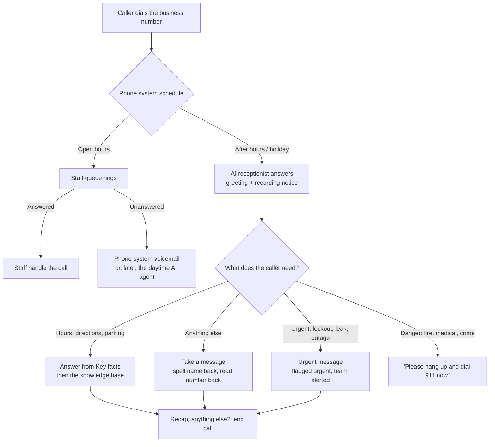
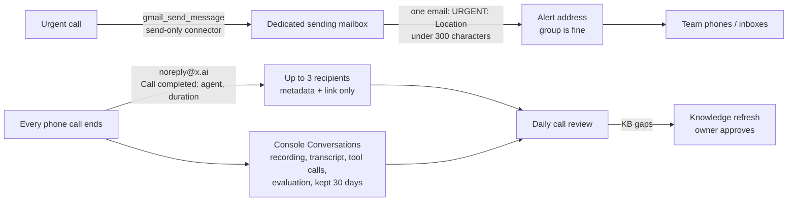

# Answering Machina

**An open-source AI phone receptionist for small businesses. It picks up when your front desk can't.**

*From Peter Chee, founder of **Thinkspace**, a coworking and virtual office business in Redmond and Seattle, WA.*

## Why we built this

Our front desk is small, and the phone is only one part of the job. The same people greet members, give tours, sort mail and packages, and keep the space running. So the phone sometimes rings while they're walking a visitor through the building or at the mailroom. The desk also has hours, and people keep calling just after we close and just before we open.

We knew some calls were going unanswered. We didn't know how many, so we pulled nine months of records from our phone system. Here's what our two main lines showed for **Jan 1 – Sep 29, 2026**:

- **328 of 2,138 real inbound calls went unanswered.** That's about 15%, roughly 1 call in 7, or 1.2 a day.
- **About two-thirds of those happened during business hours**, when whoever was at the desk was already helping someone in person, giving a tour or handling a delivery.
- **After-hours misses cluster right around closing and opening:** 4–6 PM and 6–8 AM. Late nights and weekends were rare.
- **63% of callers who reached voicemail hung up without leaving a message.** For most people, voicemail is a dead end.
- **About 30% of missed calls were followed by the same caller trying again within a day.** These are real people who need something.

Getting to those numbers took some cleanup. Almost half of the raw phone records turned out to be our own door call boxes buzzing the desk, not customers. After we removed those, plus internal calls, outbound calls and obvious spam, the picture was clear. This isn't about effort. It's coverage: one person can't be at the desk, on a tour and at the mailroom all at once.

## What we built

We built **Tess**, an AI receptionist, on xAI's [Grok Voice Agent Builder](https://x.ai/news/grok-voice-agent-builder), and we did it in one day with Grok Bot. Grok Bot interviewed me about the business, drafted Tess's script and knowledge base, and built the agent in the xAI console while I watched. Then it tested her on a free phone number, well away from our real lines.

Tess now answers our Redmond main line in two ways. After hours, she's the first to pick up. During the day, if the desk doesn't answer within about 4 rings, the call goes to Tess instead of voicemail. She:
- gives our hours, directions and parking,
- takes a message, spelling the caller's name back and reading their number back, and emails it to our team right away,
- sends an urgent alert when a call can't wait, like a member locked out of the building,
- tells anyone in danger to hang up and dial 911.

Next, we'll round out what she knows and let her route calls to the right person.

**Where it stands:** Tess passed end-to-end phone tests on 2026-09-29, and the urgent alert and the post-call email both arrived. That same night she went live on our Redmond main line, answering after hours and covering the calls the desk can't pick up during the day. We made each routing change only with an owner's OK and a written rollback plan. We don't have results from real callers yet, and we won't claim any until we do.

## Guidelines

- A non-urgent call that produces a message gets one `Message: <Location>` email through the Gmail Send Message tool; urgent calls get only one `URGENT: <Location>` email. Spam, robocalls and calls with no message get neither. The provider's post-call summary email remains separate.
- Difficult callers are handled calmly: profanity may get one warning, sexual or harassing language ends the call without a message, threats trigger 911 guidance plus an urgent alert, and self-harm gets 988/911 guidance, an urgent alert and no premature hang-up. Never argue, judge or repeat the caller's words. 988 is US-only.
- No deals or freebies: do not agree, refuse or hint at free or discounted space, rooms, trials, waived fees, special rates or other deals, even if the caller insists or claims a promise. Say "I'm not able to arrange that, but I'll pass it along to the team," take a message including the request, and never book, hold, reserve or grant access.

See [`templates/prompt.md`](templates/prompt.md), [`templates/guardrails.md`](templates/guardrails.md) and [`templates/alerts.md`](templates/alerts.md) for the full rules.

## What it does for you

Answering Machina packages everything we learned into a kit you can reuse for your own business:

- **Callers get an answer instead of voicemail.** They hear your hours, directions and parking, or leave a properly taken message.
- **Urgent calls reach you right away**, as one short email to the address you pick.
- **Your phone system stays in charge.** The AI only gets the calls you route to it, and your routing changes only when you say so.
- **Every call can be reviewed.** Each call triggers a post-call email and leaves a full transcript in the xAI console, and Grok Bot can review those every weekday morning.
- **It's cheap to run.** At xAI's published rates, a call on the free number costs about 9 cents a minute (see [What it costs](#what-it-costs)).

## What it costs

**Our early number:** under 10 cents a call so far, in early testing. Over 30 days, the xAI console showed $0.37 of usage for 5 short real calls plus some browser test sessions. We haven't reconciled that against the per-minute rate below yet, so budget from the published rate.

**xAI's published rate:** $0.08 per minute of audio, plus $0.01 per minute on the free phone number ([xAI pricing](https://docs.x.ai/developers/pricing), [Voice Agent Builder announcement](https://x.ai/news/grok-voice-agent-builder)). That's $0.18 for a 2-minute call and $0.27 for a 3-minute call. For more detail and what we haven't verified, see [Cost details](#cost-details).

**Other AI answering services**, from each company's own pricing page, as checked on Sep 29, 2026:

| Service | Billed by | Entry plan | Beyond what's included |
| --- | --- | --- | --- |
| [Phone2](https://www.phone2.ai/pricing) | Call | $99/mo, 500 calls | $0.99/call |
| [Upfirst](https://www.upfirst.ai/pricing) | Call | $24.95/mo, 30 calls | $1.50–$0.70/call, by plan |
| [Aira](https://www.getaira.io/agents/receptionist/pricing) | Call | $24.95/mo, 30 calls | $1.50–$0.70/call, by plan |
| [Smith.ai AI Receptionist](https://smith.ai/pricing/ai-receptionist) | Call | Free, 25 calls; Pro from $150/mo, 75 calls | $2.10–$3.00/call, by plan |
| [Trillet AI Receptionist](https://www.trillet.ai/pricing) | Minute | $49/mo, 150 min | $0.20/min |
| [Rosie](https://heyrosie.com/pricing) | Minute | $49/mo, 250 min | Moves you up to the next plan |
| [Dialzara](https://dialzara.com/pricing) | Minute | $29/mo, 60 min | $0.48–$0.35/min, by plan |
| [Goodcall](https://www.goodcall.com/pricing) | Unique caller | $79/mo, 100 callers, unlimited minutes | $0.50/caller |

Prices change, so check the links before you decide. These services set things up for you and bundle features this kit doesn't have. With this kit, the tradeoff for the lower per-call cost is the owner's time for setup and review. The full fact-check, with the math, is in [docs/research/pricing-factcheck.md](docs/research/pricing-factcheck.md).

## Quick start

1. **Add Answering Machina to Grok Bot and answer its questions.** The one-click Grok Bot template isn't published yet. Until it is, give Grok Bot the seven playbooks in [`skills/`](skills/) and ask it to run **getting-started**. It asks one question at a time: your hours and locations, your phone system, what counts as urgent, where alerts go, and the exact recording notice you want.
2. **Review its drafts, then let it build and test.** It writes the script, guardrails and knowledge base for you to check. Then it builds the agent in [console.x.ai](https://console.x.ai) while you're signed in, and you call a free test number from your cell to try it.
3. **Turn it on when you're ready.** It checks your phone system without changing anything, writes a routing plan with a rollback, and makes the change only when you say so. Start with after hours, and add daytime overflow once you trust it.

No Grok Bot? Everything works by hand too. See [Manual use](#manual-use-without-grok-bot).

---

## Who it's for
- Small businesses with a front desk that is sometimes busy or closed: coworking spaces, offices, clinics, studios, property managers, trades.
- Owners who want calls answered **without** handing an AI their whole phone system.
- People setting this up for a client who want a repeatable, reviewable process.

## How it works
Your phone system stays in charge and sends calls to the AI **only** when you tell it to: after hours at first, and later as daytime overflow. The agent answers from a short **Key facts** block plus a small knowledge base, takes messages, and never transfers after hours. For urgent calls, it sends one short email through a send-only Gmail connector. xAI sends a metadata-only "Call completed" email for every phone call, and the full transcript lives in the console.

### Call flow


### Alert and review path


## What's in the box
```
skills/      7 playbooks: getting-started, receptionist-design, voice-agent-setup,
             phone-forwarding, business-hours-mode, call-review, knowledge-refresh
templates/   intake, prompt (with Key facts), guardrails (10 + extras), intents,
             test-script, alerts, welcome lines, kb/ examples
examples/    sunny-desk-coworking/: a complete fictional deployment
docs/        phone-systems, recording-consent, go-live-checklist, call-review,
             troubleshooting, CONTRIBUTING, research/
```

## Setup with Grok Bot, step by step
1. **Interview** (**getting-started**). Add the playbooks in [`skills/`](skills/) to Grok Bot (or import the template once it's published). The bot asks one question at a time about key facts, your phone system, urgent calls, the alert address and the recording sentence.
2. **Drafts** (**receptionist-design**). It writes the Instructions, guardrails, KB and test script in a folder on its computer for you to review.
3. **Console build** (**voice-agent-setup**). You sign in to [console.x.ai](https://console.x.ai) in the bot's browser. The bot takes a screenshot before and after each change and asks your OK before each live step. You do every sign-in yourself; it never handles keys or passwords.
4. **Phone test.** Call the free xAI test number from your cell and run the test script. Check urgent alerts and post-call emails with real phone calls.
5. **Routing** (**phone-forwarding**). The bot reviews your phone system read-only, writes a routing plan with a rollback, and makes the after-hours change only when you say so.
6. **Ongoing** (**call-review**, **knowledge-refresh**). It reviews calls every weekday morning and keeps the knowledge current. After 1 to 2 weeks, you can add daytime overflow (**business-hours-mode**).

## Manual use (without Grok Bot)
1. Copy `templates/` to a new folder and fill in `intake.md`.
2. Fill in `prompt.md` (keep the **Key facts** block), `welcome.txt`, `guardrails.md` and `kb/`. Use `examples/sunny-desk-coworking/` as a model.
3. In console.x.ai, go to Voice Agents and create an agent from **Customer Support**. Then:
   - Paste the Instructions, reload, and check that the first and last lines survived.
   - Add the **10** guardrails (Name + Description).
   - Set the Welcome message and time zone, and decide on **Know caller's phone number**.
   - Upload the KB to a file collection and enable `end_call`.
   - Connect Gmail **with only Send Message enabled**, using a dedicated mailbox.
4. Publish. Add a free test number (Deployment, Add number) and set up post-call notifications (up to 3 addresses, with a minimum duration such as 10 s).
5. Run `templates/test-script.md` **by phone**. "Try it live" needs a microphone and never sends post-call emails.
6. Route after-hours calls using `docs/phone-systems.md`, work through `docs/go-live-checklist.md`, then review calls daily with `docs/call-review.md`.

## Cost details
Checked against xAI's published pages on 2026-09-29. Check the current [xAI pricing page](https://docs.x.ai/developers/pricing) before you budget.
- **Voice agent audio**: $0.08 per minute ([xAI pricing](https://docs.x.ai/developers/pricing)). The [Voice Agent Builder announcement](https://x.ai/news/grok-voice-agent-builder) says agents are billed at the API rate, with voices included and no separate platform fee.
- **Free provisioned phone number**: the number itself is free, and calls on it cost **an extra $0.01 per minute** (same announcement).
- **Post-call notification emails**: the settings dialog says "No charge per email".
- **Worked example** (those two rates only): a 2-minute call on the free number is 2 × ($0.08 + $0.01) = **$0.18**.

**Not known or not verified** (we won't guess):
- Whether knowledge-base searches inside the Builder are billed separately. The API pricing page lists `collections_search` at $2.50 per 1,000 calls and collection storage at $0.10/GiB/day for API use, but doesn't say whether or how that applies to Builder agents.
- The cost of a second number (for example, for a daytime agent) and of bring-your-own-number SIP trunking, which your provider sets.
- Your phone plan's charges for forwarded calls. A forwarded call can use minutes on your plan as well as xAI minutes.
- The cost of the dedicated Gmail or Workspace mailbox, and of running Grok Bot.

## Limitations
- **Beta console.** xAI's Voice Agent Builder is in beta, and its screens and limits change. The skills say what was seen and when, and flag anything unverified.
- **No schedule in the agent.** Your phone system decides when calls reach it.
- **Post-call email is metadata only**, with no summary or urgency flag. Details stay in Conversations for 30 days.
- **Urgent alerts depend on the agent** classifying the call correctly and on the Gmail connector staying signed in. Test them with real phone calls and review daily.
- **Send-only still means the agent can send email.** Anyone who can talk to the agent can trigger its enabled tools. That's why the connector is send-only and the Instructions name a single recipient.
- **Knowledge search can miss facts**, so the basics go in the Key facts block.
- **At most 10 console guardrails.** Extra rules go in the Instructions.
- **Transfers are cold** (unannounced), and they're off after hours by design.
- **Configuration is by hand.** We didn't see any export or config API, so keep your files and screenshots.
- **"Try it live" needs a microphone** and doesn't send post-call emails.
- Free provisioned numbers are released after 30 days without calls, according to the console.
- Concurrency limits for Builder calls aren't documented. Test every language you rely on.
- The phone and consent docs are US-focused. **Nothing here is legal advice.**

## Contributing
See [docs/CONTRIBUTING.md](docs/CONTRIBUTING.md). Don't include real personal data or secrets, and verify everything or mark it as unverified.

## License
Answering Machina is released under the [MIT License](LICENSE). Copyright (c) 2026 Peter Chee.

**Not affiliated with xAI.** This is an independent project, not affiliated with, sponsored by or endorsed by xAI. "Grok", "xAI" and other product names belong to their owners.
